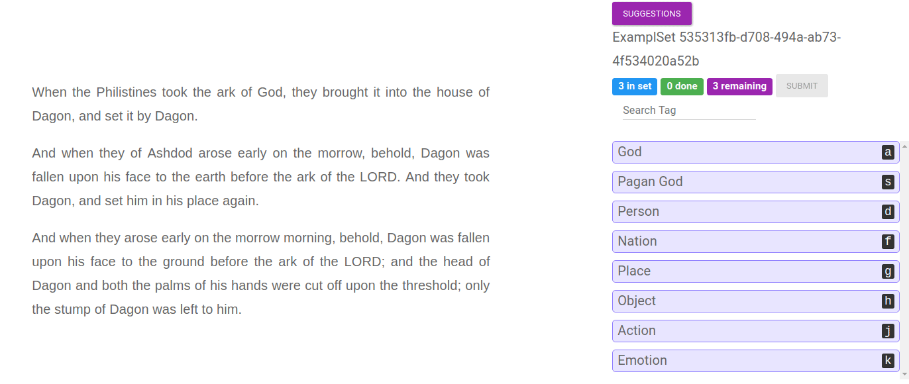

# Getting Text into Tensorflow with the Dataset API
This repo is an accompinemnt to my Blog Post [Getting Text into Tensorflow with the Dataset API](https://medium.com/@TalPerry/getting-text-into-tensorflow-with-the-dataset-api-ffb832c8bec6)
Inside, we build a simple GRU based model to predict the Book a particaular verse in the bible came from.

## Structure
* **PrepareBibleExamples.ipynb** Takes the raw file of the bible, splits it into books, chapters and verses.
This is the preparation of our raw data. At the end of the notebook, we convert the structured training examples
into TFRecords
* **preppy.py** Contains the logic to convert a raw example made in the notebook into a TFRecord
* **prepare_dataset.py** Here we *use* the Dataset API, so look here if that's what you're after.
* **model.py** The definition of the model we use. Nothing to fancy here.
* **trainer.py** The code to run a training and validation loop. Look here to see how we leverage the Dataset and its Iterator
    to easily to a train epoch and then a val epoch.

## Using this
* Clone the repo
* Run through the notebook **PrepareBibleExamples.ipynb**. This will create the TFRecords
* run python trainer.py

But if you just do this, what have you learnt ? Read the code

## Other stuff
* Found a mistake, have a suggestion ? Pull requests are welcome.
* This isn't supposed to be a good neural network, don't learn that from here.
* Thanks to the WildML blog for the [great post](http://www.wildml.com/2016/08/rnns-in-tensorflow-a-practical-guide-and-undocumented-features/)
 on TFRecords and sequences
* The [Tensorflow guide on the Dataset API](https://www.tensorflow.org/programmers_guide/datasets#using_high-level_apis)
 is good.  Go read it.

## Need to label data before putting it into Tensorflow ?
This post and repo are brought to you by LightTag,  a platform to manage and execute NLP annotations with a team.
Check us out at [LightTag.io](https://lighttag.io)

